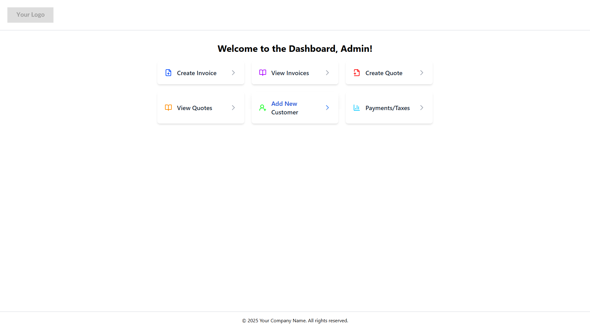

# InvoiceSync - Invoice & Quote Management System

<div align="center">
  
  <br />
  <h3>A comprehensive business invoicing solution for locksmith services</h3>
</div>

## Overview

InvoiceSync is a full-stack web application designed specifically for locksmith businesses to streamline their invoice and quote management workflow. This project handles the complete lifecycle of client interactions - from creating quotes to converting them into invoices, tracking payments, and managing customer information.

## Features

### Core Functionality

- **Dashboard Overview**: At-a-glance view of business operations
- **Quote Management**: Create, view, and manage customer quotes
- **Invoice System**: Generate invoices with automatic tax calculations
- **Customer Management**: Store and access customer information
- **Service Catalog**: Maintain a database of services with pricing
- **VIN Decoder Integration**: Automatically retrieve vehicle information for automotive locksmith services

### User Experience

- **Responsive Design**: Full compatibility across desktop and mobile devices
- **PDF Generation**: Create professional PDFs for quotes and invoices
- **Security**: Protected routes with authentication and session management
- **Real-time Updates**: Automatic status transitions for invoice aging

## Tech Stack

### Frontend
- **Framework**: Next.js 15
- **UI**: React 18 with Tailwind CSS
- **Components**: Custom UI components + shadcn/ui
- **State Management**: React Hooks + SWR for data fetching
- **Icons**: Lucide React icons
- **Authentication**: NextAuth.js for secure login

### Backend
- **API Routes**: Next.js API routes (serverless)
- **Database**: PostgreSQL with node-postgres
- **Authentication**: JWT with secure HTTP-only cookies
- **Security**: Turnstile integration for bot protection
- **PDF Generation**: Custom PDF generation with Puppeteer

### DevOps
- **TypeScript**: End-to-end type safety
- **Performance**: Optimized with caching strategies
- **Security**: Input validation and sanitization

## Project Structure

```
src/
├── app/                # Next.js app router
│   ├── api/            # API routes
│   ├── dashboard/      # Protected dashboard routes
│   └── globals.css     # Global styles
├── components/         # Reusable components
│   ├── ui/             # UI component library
│   ├── InvoiceList.tsx # Invoice listing component
│   └── ...
├── lib/                # Utilities and helpers
│   ├── constants.ts    # Application constants
│   ├── db.ts           # Database connection
│   └── types.ts        # TypeScript type definitions
```

## API Endpoints

The application exposes several RESTful API endpoints:

- `GET/POST /api/data/invoices` - List and create invoices
- `GET/POST /api/data/quotes` - List and create quotes
- `GET/POST /api/data/customers` - Manage customer data
- `GET /api/data/vin-decode` - Decode VIN numbers via external service

## Authentication & Security

- **Login Security**: Password hashing with bcrypt
- **Session Management**: JWT tokens with automatic expiration
- **CRUD Protection**: All data operations require authentication
- **Bot Protection**: Cloudflare Turnstile integration

## Screenshots

<div align="center">
  
  <h4>The Sign-in</h4>
</div>

<div align="center">
  
  <h4>The Dashboard</h4>
</div>

<div align="center">
  
  <h4>Create Invoice Page</h4>
</div>

<div align="center">
  
  <h4>Adding/Updating Customers Page</h4>
</div>

<div align="center">
  
  <h4>Invoice List Page</h4>
</div>

<div align="center">
  
  <h4>Example of an Invoice</h4>
</div>

## Future Enhancements

- **Analytics Dashboard**: Business insights and reporting
- **Mobile App**: Native mobile experience
- **Inventory Management**: Track parts and materials

## License

This project is private and proprietary.

## Author

Developed by Carmine Potirniche as a demonstration of full-stack development capabilities using modern web technologies.
